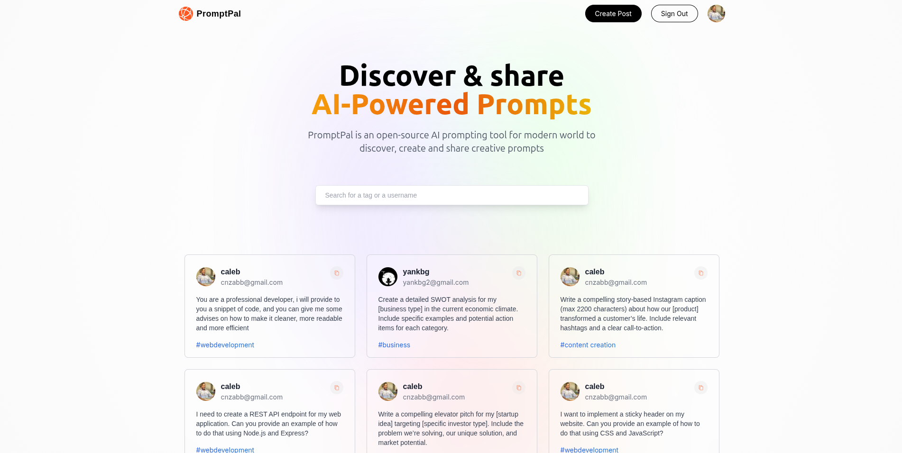
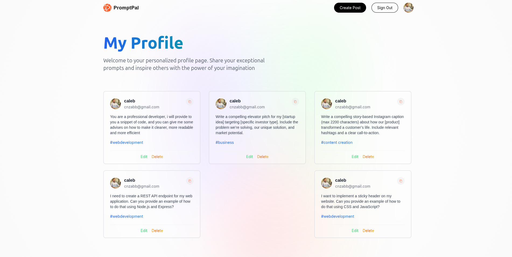
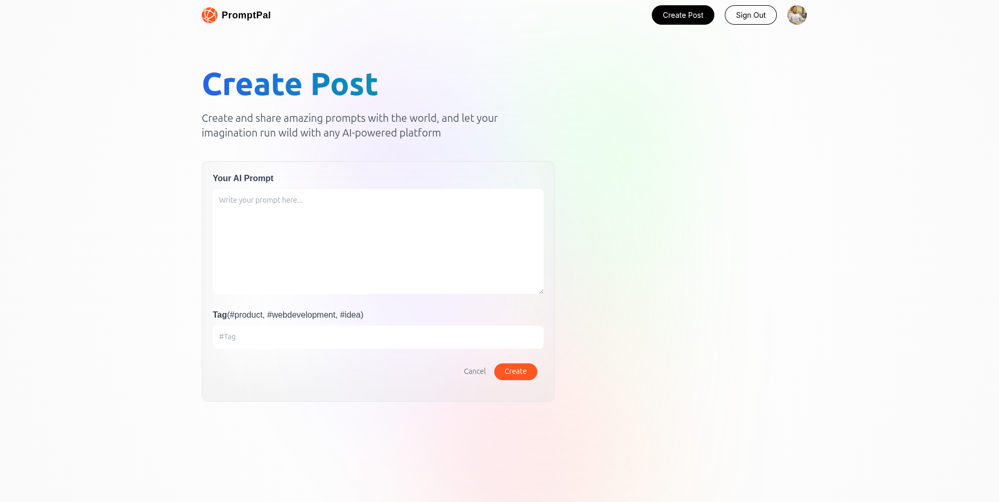

<div align="center">
  <h1>🧠 PromptPal</h1>
  <p><em>A full-stack Next.js 14 application for discovering, creating, and sharing AI prompts</em></p>
  <a href="https://wakatime.com/badge/user/8f8a5854-8346-48b3-a0d4-9835980803aa/project/2b3a7a32-67c8-4f56-b224-4f125f7f9c4b">
    
  </a>

  <div>
    
    
    
</div>
</div>

---

## ⚙️ Tech Stack

- **Next.js 14**
- **MongoDB + Mongoose**
- **NextAuth.js** (Google Auth)
- **TailwindCSS**

---

## 🔋 Features

- 🌟 **Glassmorphism Design** — A sleek, modern UI built with visual polish
- ✨ **Prompt Discovery & Sharing** — Explore prompts or contribute your own
- 📝 **Editable & Deletable Prompts** — Maintain control over your creations
- 🙍‍♂️ **User Profiles** — See all prompts from an individual creator
- 🔍 **Search by Tags** — Find what you need faster with intelligent filtering
- ✅ **Copy to Clipboard** — Easily grab a prompt for quick use
- 🔐 **Google Authentication** — Safe and seamless login experience
- 📱 **Fully Responsive** — Optimized for mobile, tablet, and desktop

---

## 🖼️ Screenshots

Here’s a quick look at **PromptPal** in action:

### 🌐 Home Page


### 👤 User Profile



### 🔍 Post Creation



> 📸 To add your own screenshots, save them in a folder like `assets/screenshots/` and update the paths accordingly.


## 🤸 Quick Start

### 📦 Prerequisites

- [Node.js](https://nodejs.org/en)
- [npm](https://www.npmjs.com/)
- [Git](https://git-scm.com/)

### ⏬ Installation

```bash
git clone https://github.com/adrianhajdin/project_next_13_ai_prompt_sharing.git
cd project_next_13_ai_prompt_sharing
npm install
```

## 🚧 Environment Configuration

Before launching **PromptPal**, set up your environment variables. Create a file named `.env` in the root directory and add the following:

```env
NEXTAUTH_URL=http://localhost:3000
NEXTAUTH_URL_INTERNAL=http://localhost:3000
NEXTAUTH_SECRET=your_generated_secret
GOOGLE_ID=your_google_client_id
GOOGLE_CLIENT_SECRET=your_google_client_secret
MONGODB_URI=your_mongodb_connection_string
```

Replace the placeholder values with your actual credentials. You can obtain these credentials by signing up on these corresponding websites from [Google Cloud Console](https://console.cloud.google.com/welcome?rapt=AEjHL4MBaLLneW6OfAHf_zgms1eWZFw1wdy0_KIC4uh1nEqh2m4ojOvrXNlzJ4h7CZTkpiWgcsoHbUvS-FMdCP7WIkaVlPAeU7cnVR6Y0wJHeLMOtU6KAzA&project=promptopia-385410), [Cryptpool](https://www.cryptool.org/en/cto/openssl) (for random Auth Secret), and [MongoDB](https://www.mongodb.com/).
## 🔐 Credential Sources

To run PromptPal securely, you'll need to generate credentials from the following platforms:

| Provider | Credential | Description |
|----------|------------|-------------|
| [Google Cloud Console](https://console.cloud.google.com/) | `GOOGLE_ID` & `GOOGLE_CLIENT_SECRET` | Used for OAuth 2.0 authentication via NextAuth |
| [Cryptool OpenSSL Generator](https://www.cryptool.org/en/cto/openssl) | `NEXTAUTH_SECRET` | Secure, random string for token signing |
| [MongoDB Atlas](https://www.mongodb.com/cloud/atlas) | `MONGODB_URI` | Connection string for your cloud-hosted MongoDB database |

> 💡 After generating these values, add them to your `.env` file before starting the project.

## 🚀Run the Project Locally

```bash
npm run dev
```

Open [http://localhost:3000](http://localhost:3000) in your browser to view the project.
